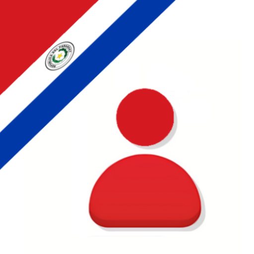
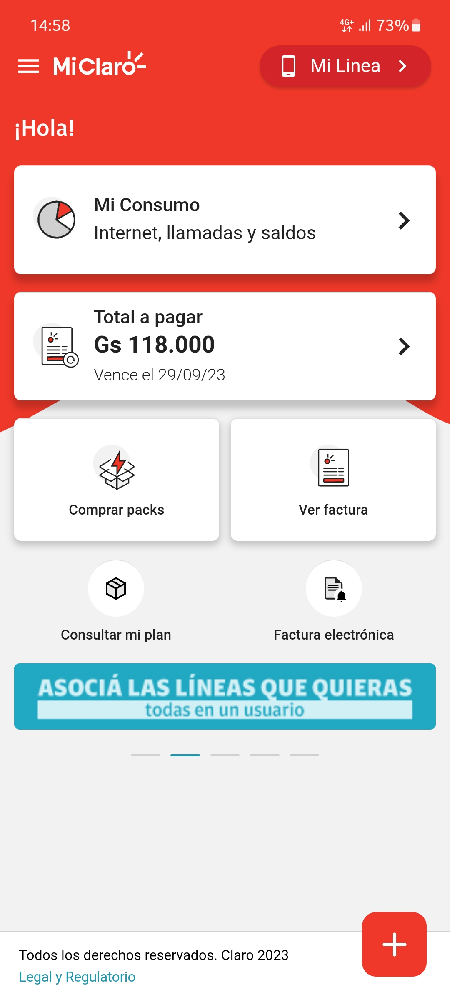
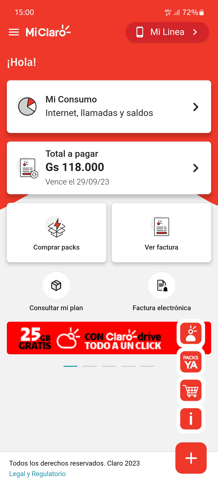
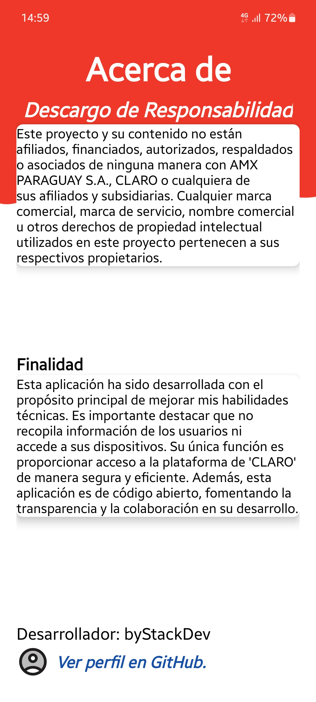

    
    <h1>Mi Claro Paraguay</h1>
    
Mi Claro es tu canal de autogestión, tus consultas son más simples, rápidas y sin cargo.

---

  
  
  

## Caracteristicas
- Ver los detalles de tu plan, tus consumos y saldos disponibles
- Compra de packs
- Acceso a la tienda de Claro
- Descargar tu factura
- Cambiar la contraseña de tu WiFi
- Y mucho más.

Además, no consume datos y está disponible para líneas masivas Prepago, Plan Control, Plan Libre y Claro Hogar.

Registrate con tu correo, asociá tus productos Claro y listo!

## Descarga

## Descargo de Responsabilidad
Este proyecto y su contenido no están afiliados, financiados, autorizados, respaldados o asociados de ninguna manera con AMX PARAGUAY S.A., CLARO o cualquiera de sus afiliados y subsidiarias.

Cualquier marca comercial, marca de servicio, nombre comercial u otros derechos de propiedad intelectual utilizados en este proyecto pertenecen a sus respectivos propietarios.
La aplicación no busca supantar a la original de la compañia, solo brinda acceso a la plataforma, no recopila ninguna información, tampoco tiene acceso al dispositivo ni hace seguimiento al usuario. 

## Diferencias con la aplicación oficial
- El tema por defecto es modo claro
- Permite la navegación en diferentes páginas 
- Soporta desde android 7.0 en adelante

